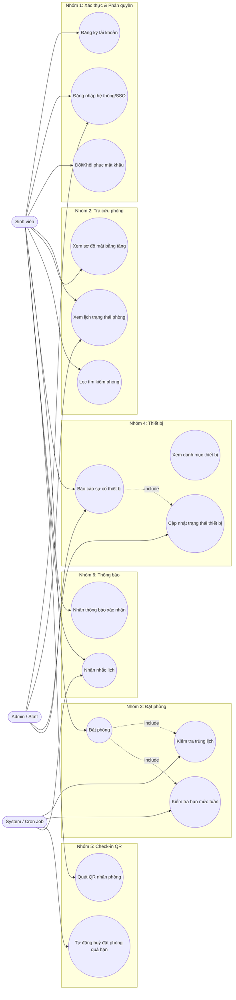
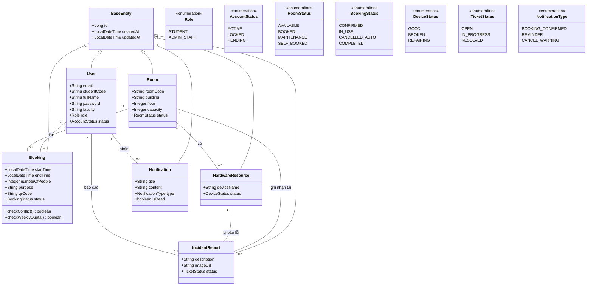
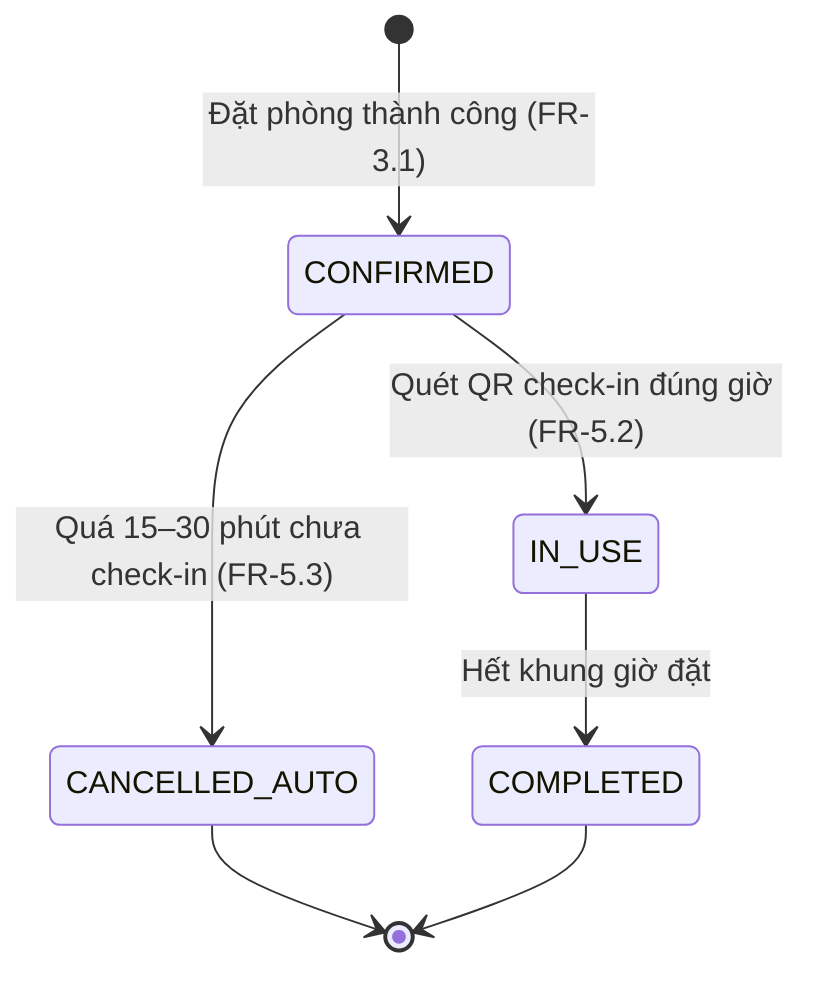
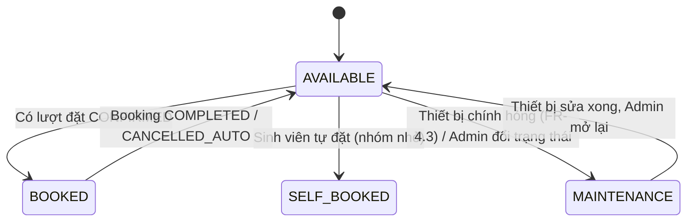
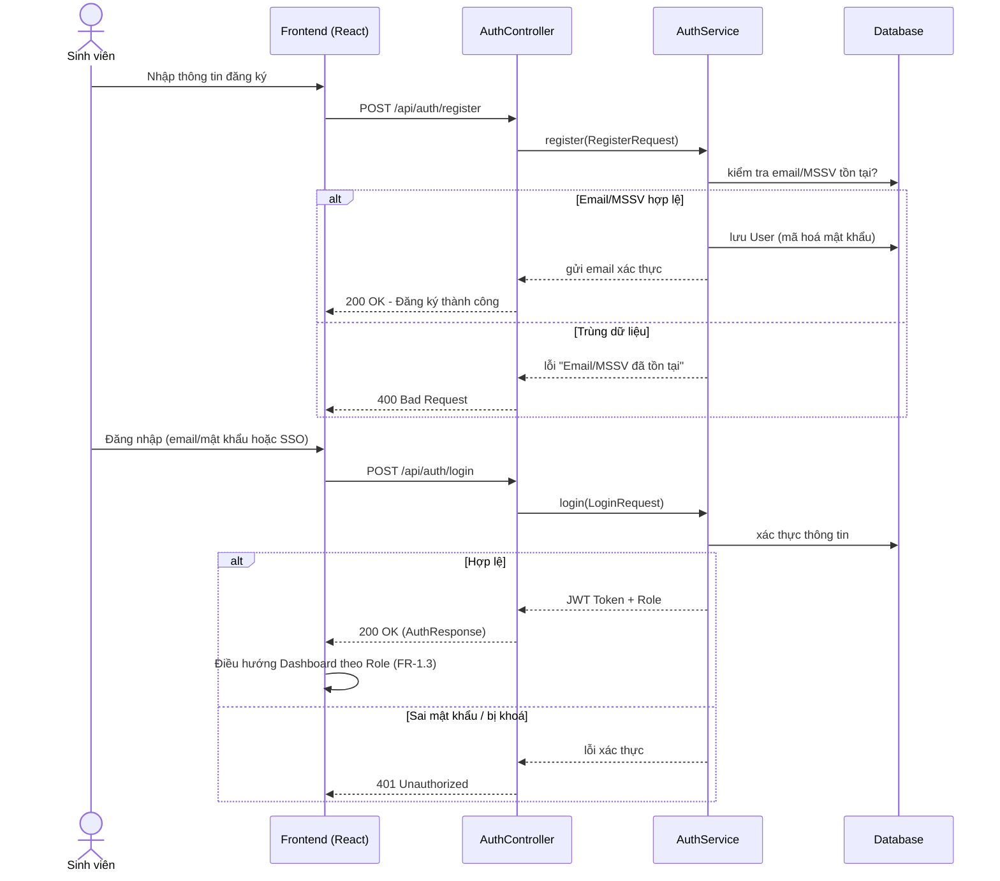
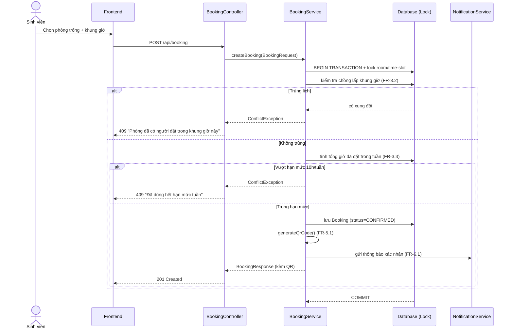
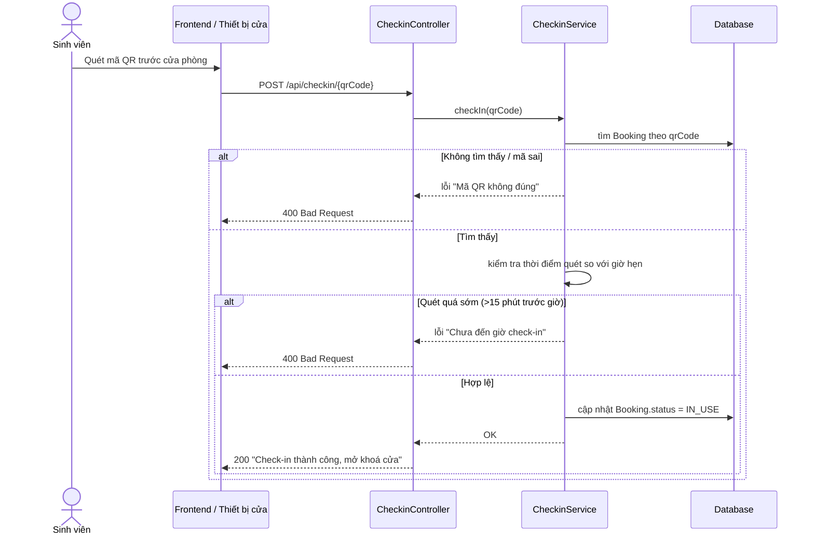
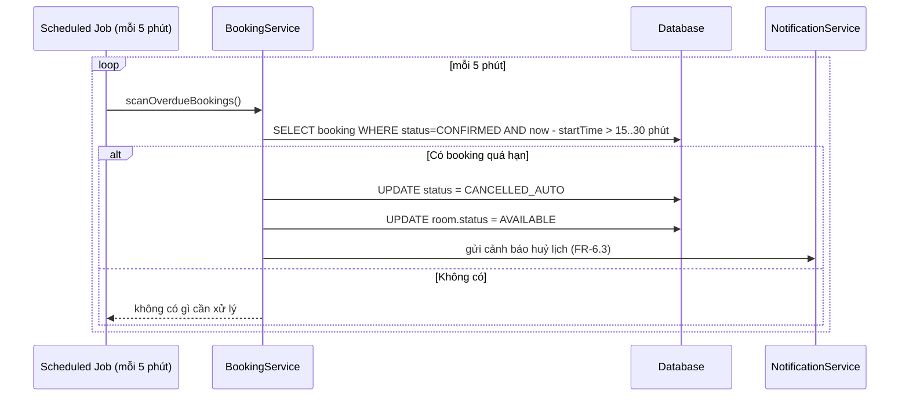
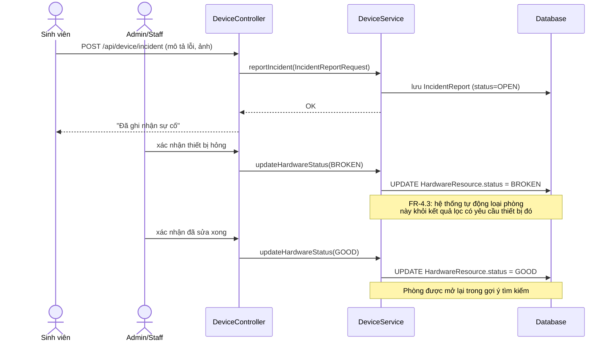

# Thiết kế UML — Smart Campus Facility & Study Room Reservation Platform

Tài liệu này bổ sung cho `Đặc_tả_phần_mềm_theo_chuẩn_ISO_IEEE_29148.pdf`, chuyển các yêu cầu
FR-1.x → FR-6.x và NFR-01 → NFR-04 thành các biểu đồ UML để đội dev dùng làm cơ sở implement.
Các diagram dùng cú pháp **Mermaid** — GitHub, GitLab và VS Code đều render trực tiếp trong `.md`.

---

## 1. Use Case Diagram

Tác nhân: **Sinh viên (Student)**, **Admin/Staff**, **System (Cron Job / Background Service)**.

---

## 2. Class Diagram

Bám sát 6 entity đã dựng trong `entity/` của backend skeleton.

---

## 3. State Diagram

### 3.1 Trạng thái Booking (FR-3.1, FR-5.2, FR-5.3)

### 3.2 Trạng thái Room (FR-2.4, FR-4.3)

---

## 4. Sequence Diagrams — các luồng nghiệp vụ chính

### 4.1 Đăng ký & Đăng nhập (FR-1.1, FR-1.2, FR-1.3)

### 4.2 Đặt phòng + chống trùng lịch + hạn mức tuần (FR-3.1, FR-3.2, FR-3.3)

### 4.3 Check-in bằng QR (FR-5.2)

### 4.4 Tự động huỷ đặt phòng quá hạn — Auto-release (FR-5.3)

### 4.5 Báo cáo & xử lý sự cố thiết bị (FR-4.2, FR-4.3)

---

## 5. Ghi chú cho các nhóm

- **Class Diagram** ở mục 2 khớp 1:1 với entity đã có trong `backend/src/main/java/.../entity/`.
  Khi nhóm nào cần thêm field, hãy cập nhật lại diagram này để cả team không lệch ERD.
- **Sequence Diagram** ở mục 4 tương ứng đúng Normal Flow / Exception Flow trong SRS — dùng làm
  cơ sở viết method trong `Service` và test case (happy path + exception path).
- Diagram này **chưa** vẽ chi tiết luồng SSO Google, luồng OTP khôi phục mật khẩu, và luồng
  Notification queue khi email bị nghẽn — có thể bổ sung sau khi nhóm Auth/Notification chốt
  chi tiết kỹ thuật (OAuth2 provider, hàng đợi email dùng công nghệ gì).
